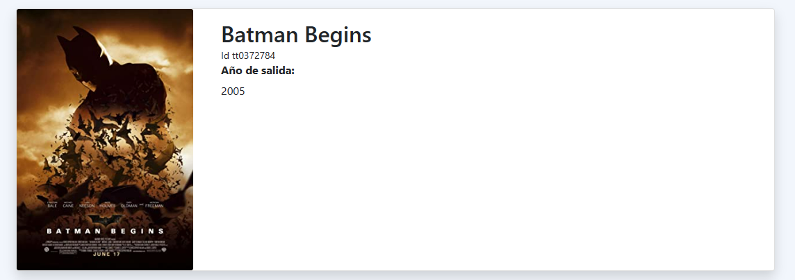

# Movie Gallery for Evertec

## Descripción

Este repositorio contiene la arquitectura y tecnologías utilizadas; Basado en la arquitectura limpia de Microsoft.

## Contexto

Aplicación con la finalidad de obtener listados de peliculas, dependiendo del nombre que se dé en el filtro de búsqueda.

### Tecnologías

* C# 10 (.NET Core 6)


### Referencias de arquitectura

* Dependency Injection

### Estructura de carpetas

```
src/
|- MovieCollection.Core/
|- |- MovieCollection.Core.csproj

|- MovieCollection.Infrastructure/
|- |- MovieCollection.Infrastructure.csproj

|-  MovieCollection/
|- |- MovieCollection.UI.csproj
```


### Características de la aplicación

Se realiza la aplicación web siguiendo detalladamente los requerimientos de la prueba:

- Como un usuario regular deseo poder ver el listado de colección de películas para así
poder compararlo con mi listado.
  + El listado debe contener la imagen (“poster”) de la película y su título/nombre.

  
- Como un usuario regular deseo poder hacer una búsqueda de la colección por el 
título/nombre de la película.
  + Debe tener un encasillado donde puedas introducir palabras claves y un botón
  
para someter la búsqueda.
  + Una vez sometida la búsqueda la búsqueda debe ser de toda película que 
contiene esa palabra clave.


### Extras

Se agrega paginador simple en el píe de página, para navegar sobre todos los resultados disponibles, aprovechando la paginación que provee el API de OMDb.


## Referencias

- [Clean Architecture](https://learn.microsoft.com/en-us/dotnet/architecture/modern-web-apps-azure/common-web-application-architectures#clean-architecture)

- [Wikipedia: Markdown](http://wikipedia.org/wiki/Markdown)
